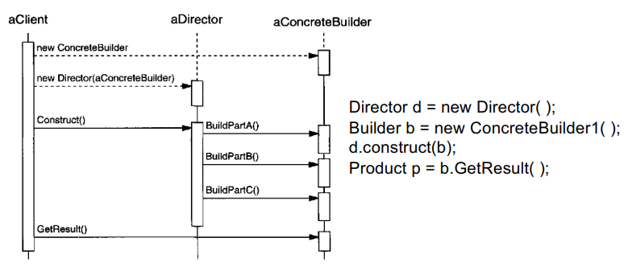

Builder 
– Applicability 
	– The algorithm for creating a complex object should be independent of the parts that make up the object and how they're assembled
	– The construction process must allow different representations for the object that's constructed
– Benefits
	– Gives flexibility that can be extended by implementing new subclasses of the Builder, and isolates code of construction from implementation
– Limitations 
	– Not completely generic, less useful in situations where variety of implementations is not high 

Its main purpose is to make, making classes with many attributes much much easier, as it is harder to remember where all the pieces in a constructor go (see code examples)

Participants
- Builder (interface)
	- Specifies an abstract interface for creating parts of a Product object 
- ConcreteBuilder (actual class that implements it)
	- Constructs and assembles parts of the product by implementing the Builder interface 
	- defines and keeps track of the representation it creates. 
	- provides an interface (GetResult) for retrieving the product